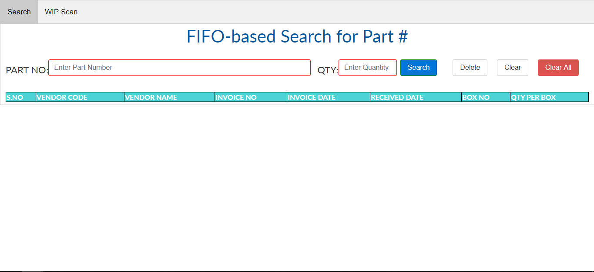
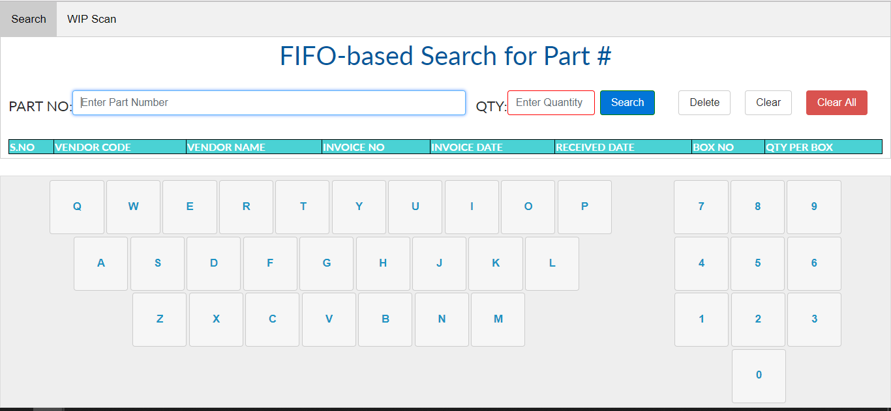
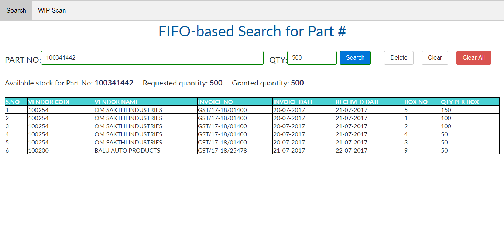

# Factory-Cargo-Allocation
 A web-based factory cargo allocation system to allocate cargo efficiently in a factory.
 
 How it works
 ------------
 <ul>
 <li>Records of cargo available in a factory is stored in the database.</li>
 <li>Whenever a factory worker needs a certain item of a specified quantity, he searches the factory cargo allocation system for the item specifying the required quantity.</li>
 <li>The factory cargo allocation system acts as the interface between the worker and the database, searches for the item in the database, and allots the required quantity of the item detailing the box numbers of the cargo to be picked up.
 <li>The system issues a warning if the item or required quantity is not available.</li>
 </ul>
 
 Pre-requisites
--------------
<ul>
 <li>PHP</li>
 <li>Apache</li>
 <li>MySQL</li>
 <li>phpMyAdmin</li>
</ul>

Deployment
----------
<ul>
 <li>Setup the Apache server and MySQL through XAMPP or a distribution software of your choice.</li>
 <li>Start the apache server and MySQL.</li>
 <li>Clone the project to your server's default path.</li>
 <li>Go to <b><i>localhost/phpmyadmin/</i></b> on your web browser, navigate to <b>Import</b>, select the SQL dump file <b><i>mts1_dump.sql</i></b> present in the <b><i>Content/</i></b> folder, and select Go. The database of the the factory cargo will be created.
 <li>Run the app on your web browser at <b><i>localhost/Factory-Cargo-Allocation/content/index.php</i></b>.</li>
 <li>Search for an item and required quantity in the interface.</li>
</ul>

Screenshots
-----------

